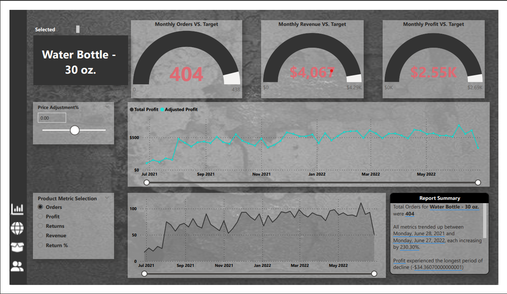
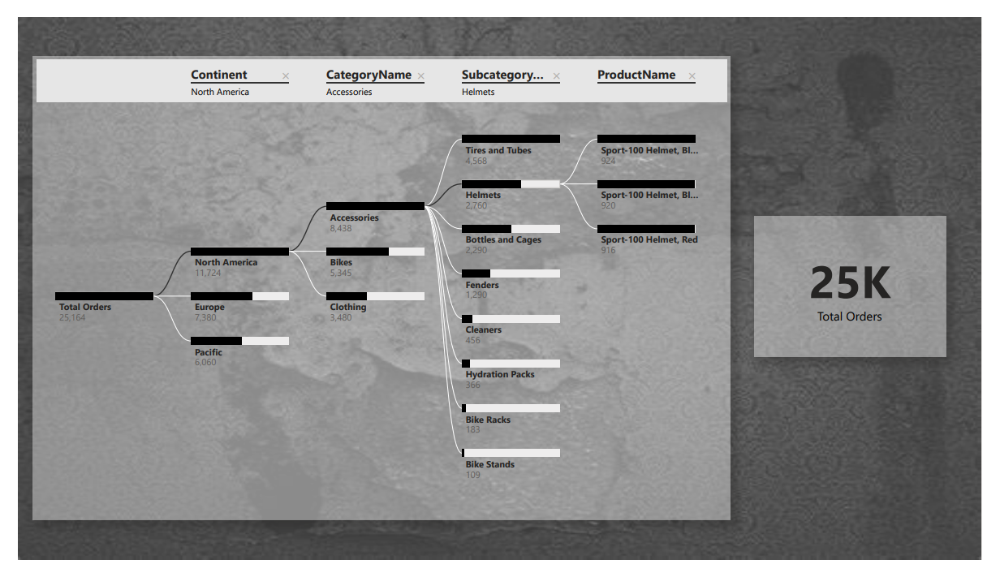

# AdventureWorks Dashboard

Welcome to the AdventureWorks Dashboard, a comprehensive data visualization tool designed to provide insights into the company's performance, focusing on revenue, orders, returns, and product/customer details. This README file will guide you through the different pages and functionalities of the dashboard.

## Table of Contents
1. [Getting Started](#getting-started)
2. [Dashboard Overview](#dashboard-overview)
3. [Page 1: Overview](#page-1-overview)
4. [Page 2: Geographic Insights](#page-2-geographic-insights)
5. [Page 3: Product Details](#page-3-product-details)
6. [Page 4: Customer Details](#page-4-customer-details)
7. [Page 5: Tree Composition](#page-5-tree-composition)

## Dashboard Overview

The AdventureWorks Dashboard is a data visualization tool built to analyze key metrics and trends for the AdventureWorks company. It consists of five pages, each focusing on different aspects of the company's performance.

- *Link to Dashboard in Action:* [Explore the Dashboard]([https://shorturl.at/EGY05](https://www.novypro.com/project/adventureworks-report-6))

## Page 1: Overview

### Features

1. Line chart of revenue trending
2. Bar chart of orders by category
3. Cards displaying revenue, profit, orders, return rate, monthly revenue, monthly orders, and monthly returns
4. Table chart for top 10 products with return rate and revenue
5. Cards showing most ordered and most returned product types
6. Slicer for year and continent in a collapsible panel on the left

### Usage

1. Open the dashboard.
2. Explore the line and bar charts for revenue and orders.
3. Check the cards for monthly insights and top products.
4. Utilize the slicer panel to filter data by year and continent.

## Page 2: Geographic Insights

### Features
1. Map chart displaying total orders with continent slicer
2. Bubbles on the map with a total orders tooltip

### Usage
1. Navigate to Page 2.
2. Explore the map chart and use the continent slicer to focus on specific regions.
3. Hover over bubbles to view total orders for each location.

## Page 3: Product Details

### Features
1. Product details with drill-through feature
2. Gauge cards for monthly orders, revenue, and profit compared to target
3. Line chart with profit trending and parameter for price adjustment
4. Line chart for return, revenue, profit, returns, and return rate trending with slicer

### Usage
1. Access detailed product insights through the drill-through feature.
2. Check gauge cards for monthly performance against targets.
3. Explore line charts for profit trending and various metrics with the slicer.

## Page 4: Customer Details

### Features
1. Cards displaying the number of customers and revenue per customer
2. Line chart of total customers and revenue per customer with slicer
3. Pie charts showing orders by income level and occupation
4. Table of top 100 customers with full names, number of orders, and revenue
4. Slicer for date and note filter for the top customer with the most revenue in 2022

### Usage
1. Visit Page 4 to delve into customer-related insights.
2. Explore cards, charts, and tables for a comprehensive view of customer details.
3. Use slicers to filter data by date and note filter for specific customer insights.

## Page 5: Tree Composition

### Features
1. Tree composition analyzing total orders by category, subcategory, product name, and product cost
   
### Usage

1. Head to Page 5 for a hierarchical view of total orders.
2. Explore the tree to analyze orders at different levels of categorization.

Feel free to explore each page and utilize the dashboard's functionalities to gain valuable insights into the AdventureWorks company's performance. If you encounter any issues or have suggestions for improvement, please refer to the Issues section on the GitHub repository.
